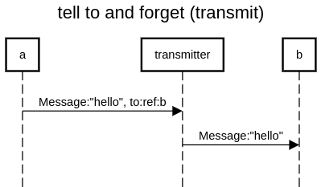

**tell** to is also called **transmit** or **forward**

https://doc.akka.io/docs/akka/current/actors.html#forward-message 



```
title tell to and forget (transmit)

a->transmitter:Message:"hello", to:ref:b
transmitter->b:Message:"hello"
```

https://sequencediagram.org/index.html#initialData=C4S2BsFMAJk9ywPbQIYDsAm0BmSBOA5pMNABTD4YDOAtmAJQBQTqAtAHyU33Bz4AuALKRq1VMQEAiABbxwSKQBpkA-JBwCARk27o6Yfpy3DR4ybPmKmQA


**other doc**
https://stackoverflow.com/questions/25115547/difference-between-forward-and-tell-in-akka-actors/25115642